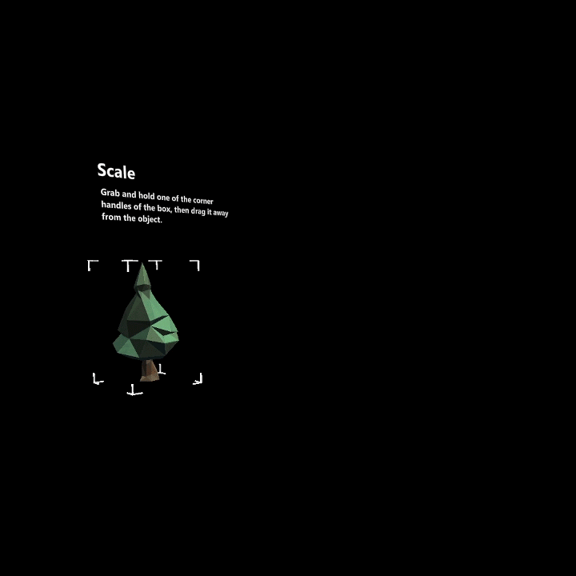
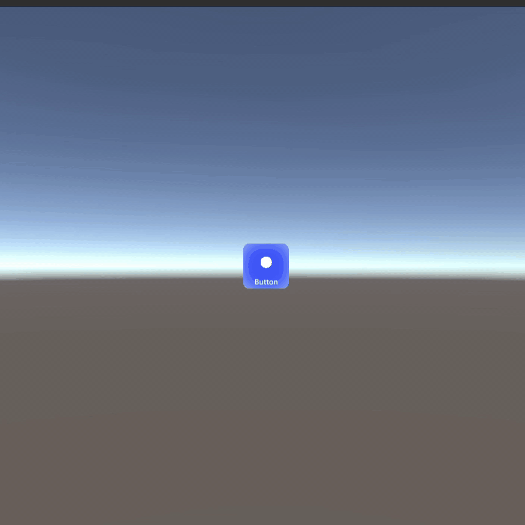

# HandMeshRecorder

### I faced a problem.

I had developed an application for the Microsoft Hololens with the MRTK. Besides its user interface, it had new hand gestures and controls that I designed. The users had to pick all of these up, and how could I demonstrate these to them in the app?

I decided that I should be able to record a ghost of my hand, demonstrating my gestures and interactions. 

### I realised there was no way for me to do it.

While the Hololens is able to sense and visualise users' hands in real time, there currently exists a gap in allowing developers to store such visualisation. 

In fact, the MRTK Hand Coach currently requires developers to manually animate a rigged hand in external software such as Autodesk Maya. (https://docs.microsoft.com/en-us/windows/mixed-reality/design/hand-coach)

Without extensive experience in animation, there was no way I would be able to animate the realistic behaviour of a hand. 

A utility for anyone to record a ghost of their hand would speed up development, and make user uptake more effective.

### But there is more!

Beyond offering merely recording and playback functionalities, the work expanded to include actuation capabilities for recordings. 

This means that handmesh recordings are now able to contain functions calls that will automatically be executed at any point in the duration of its playback, allowing each recording to be more than just visual. 

The ghost hand can now do the same things that the user can do with their hands and gestures.

    
    

### HandMeshRecorder consists of two scenes:
- A HandMesh video recorder and editor scene
- A HandMesh video playback example scene

The purpose of HandMeshRecorder is to allow the recording of user gestures, and the real-time demonstration of its effects for future playback.

This allows a developer to use such recordings for prompts or guides within their app.

### Features of HandMeshRecorder/Editor:

1. Start/Stop Record (With voice activation too)
2. Play Recording Back
3. Toggle Right and Left hands visibility 
4. Scrub Bar
5. Trim video length
6. Add/Clear keyframes (Elaborated Below)
7. Spawn/Delete GameObject (Elaborated Below)
8. Save recording to file
9. Load existing recording from file
10. Actuation using recordings

Each of the above features are saved as their own prefab buttons within the project, and these buttons can be selectively attached into the scene based on the needs of the user. 

(Demo of the HandMesh video editor, where recording and editing of the ghost hands are done.)

https://user-images.githubusercontent.com/19947577/149418259-7d91fb7c-1484-4800-a2af-cdea324506d5.mp4

### Setting up HandMeshRecorder:

HandMeshRecorder was developed on Unity 2019.4.10f1, using MRTK v2.5.3 and Windows Mixed Reality v4.2.3.

There are several MRTK setting changes that users should perform to maximise the functionalities of HandMeshRecorder.

1. It is recommended for HandMeshRecorder to be imported on an empty, separate project in order to maximise framerate and quality of recordings.

2. To play back a prior-recorded HandMesh in another project, only the HandModel prefab is required in the project. Refer to the HandMesh video playback example scene.

3. When the user intends to record his Hand Mesh while using HandMeshRecording, he should ensure that HandMeshVisualisation is turned on. This is not necessary for editing and playback.
To turn on HandMeshVisualisation, navigate to MixedRealityToolkit in the scene heirarchy, and navigate to MixedRealityToolkit> Input> Hand Tracking. Ensure that a valid HandMeshPrefab is attached and HandMeshVisualization is enabled.

4. HandMeshRecording offers the use of speech commands to start/stop recording. To enable such a feature, navigate to MixedRealityToolkit in the scene heirarchy, and navigate to MixedRealityToolkit> Input> Speech. Add two new speech commands, with keywords 'Start' and 'Stop'. You do not need to link the functions.

5. Provide permission to Music Library through App Manifest to allow saving of recording data in Music Folder

6. Edit the contents of BaseHandVisualizer.cs that comes with MRTK to the copy provided in the package. (Line 167)

7. Why are my buttons pink? You must not have installed MRTK.

8. To ensure that playback is as real-time as possible, perform your recording with same Time.fixedDeltaTime as the eventual project the playback is to be used in.

### Why the ability to include actuation?
Now that we are able to record our hand meshes, we are able to make use of these hand meshes for in-app prompts, similar to the hand coach. However, there are certain instances where developers might like to also display the outcomes of the recorded actions during playback. To do so, devs will currently have to manually code the outcomes and synchronise them with the recording. 

In certain cases, this is prohibitively difficult or borderline impossible to achieve, for example when recording the continuous dragging of a GameObject (not in a constant speed or predictable direction).

The application of actuation can be generally split into two cases:
1. Function triggers at specific timestamps

An example of this is when the recording is of an airtap being performed. In this case, a function can be triggered at the instant that the airtap is performed in the recording to trigger the outcome. 

(Marking a keyframe for a function with the HandMesh video editor)

https://user-images.githubusercontent.com/19947577/149418290-2bf9bab7-1bac-4b0c-a5c6-ec4d2aea75ee.mp4

2. Continuous GameObject Manipulation

In this case, the GameObject being manipulated has to have its state continuously stored and available for playback, unlike a one-time function trigger.

(Example of how a GameObject can be spawned and recorded together with the ghost hands. Custom GameObjects can be added too.)

https://user-images.githubusercontent.com/19947577/149418335-a7f53d32-4aa4-4e5d-9184-1325af058170.mp4

### How to include actuation?

### Function triggers at specific timestamp
As mentioned above, HandMeshRecorder comes with the feature to add keyframes into any part of the recording. Adding a keyframe at a specific frame of the recording will allow you to add in function calls using the Unity Inspector thereafter.

When playing back the recording, those functions will be triggered when its specific frame is being played.

### Continuous GameObject manipulation
As mentioned above, HandMeshRecorder comes with the feature to spawn GameObjects. By default, a collection of primitive GameObjects are included, with the option for users to add their own custom GameObjects.

When creating a recording with a spawned GameObject, saving the recording will allow create recording JSON files for both the hand meshes and the recorded GameObject. These two files then can be played back together for synchronisation. 

### Features of HandMeshPlayback:
1. HandMesh prefab allows you to play back recording at position of prefab

### Scene Guidance

##### HandMeshRecorder Scene
The scene shows the recorder/editor with all its available additional functions. This can be used directly for recording/editing. Unwanted functionality can also be remove by deleting their buttons from the scene.

##### HandMeshPlayback Scene
The scene shows the use of the HandModel prefab. You can include the HandModel prefab in your own desired scenes and attach the desired recording TXT data. The position of HandModel GameObject will be the rough position of the displayed meshes.
